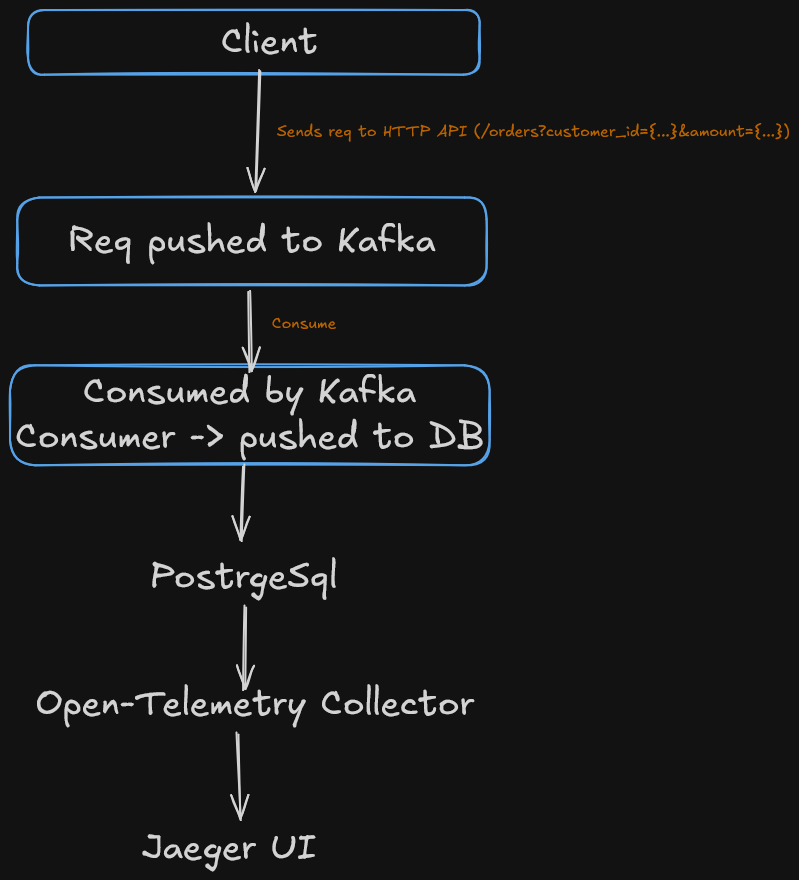

# Distributed Order Processing System with OpenTelemetry

A production-style distributed system demonstrating end-to-end observability using OpenTelemetry across HTTP services, Kafka messaging, and PostgreSQL, with trace propagation, failure simulation, and real distributed tracing visualization using Jaeger.

This project shows how modern cloud-native systems are instrumented and debugged using OpenTelemetry.

## What this project is all about?

Modern distributed systems are hard to debug because requests travel across multiple services and asynchronous systems like message queues and databases.

This project demonstrates:

1. Distributed tracing across services
2. Context propagation over Kafka
3. Failure simulation and debugging using traces
4. OpenTelemetry Collector pipeline setup
5. Real-world tracing visualization with Jaeger

Project flow:

```bash
Client ->  HTTP API -> Kafka -> Consumer -> Postgres DB
```

## Architecture



## Key Features

1. HTTP Auto instumentation
2. Mannual Kafka Instrumentation
3. Context Propagation as request flows through the API to Kafka and DB.
4. Baggage Propagation for deliberate failuer injection
5. OpenTelemetry Collector pipeline setup
6. Jaeger visualization

## Tech Stack

1. Backend Service - Go
2. Event streaming - Kafka
3. Database - PostgreSQL
4. Instrumentation - OpenTelemetry Go SDK
5. Trace visualization - Jaeger
6. Orchestrating the application - Docker

## Running Locally

1. Clone the repo:

```bash
git clone https://github.com/yaten2302/otel-playground
cd otel-playground
```

2. Start infra

```bash
docker compose up -d
```

This starts:

- Kafka
- PostgreSQL
- Jaeger
- OpenTelemetry Collector

3. Create `.env` file and add:

```bash
DATABASE_URL=postgres://<user>:<password>@localhost:5432/<database_name>?sslmode=disable
```

4. Create the Postgres table using the following command:

```bash
CREATE TABLE orders (
    order_id TEXT PRIMARY KEY,
    customer_id TEXT NOT NULL,
    amount INT NOT NULL,
    created_at TIMESTAMP NOT NULL
);
```

5. Start the application:

```bash
go run .
```

Server starts at `localhost:8000`

Send a request - `curl -X POST "http://localhost:8000/orders?customer_id=123&amount=100"`

5. View traces:

Open Jaeger UI - `http://localhost:16686`

Select service - `orders-service`

## Failure Simulation

The API allows injecting failures to observe how traces help debugging.

#### Example Requests

1. Normal flow - `curl -X POST "http://localhost:8000/orders?customer_id=1&amount=100"`

2. Break Context Propagation - `curl -X POST "http://localhost:8000/orders?customer_id=1&amount=100&fail=context"`

There are a lot of failures present in [`failures.go`](https://github.com/yaten2302/otel-playground/blob/main/failures.go) file, select and and add `?fail={fail_type}`.

## Contributing

Contributions and improvements are always welcome :)
